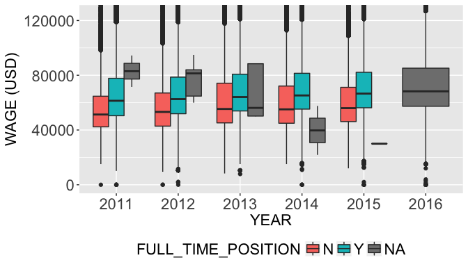

In this notebook, I will focus on the cleaning and transformation of H-1B disclosure data for the period 2011-2016. Let's begin by loading the relevant libraries.

``` r
library(dplyr)
library(ggplot2)
library(readxl)
library(hashmap)
```

<h2>
Reading Data
</h2>
The first step is to read the H-1B records. From the description files provided on the source website, the column names for almost all the columns changed 2015 onwards. However, the values of categorical features remain the same. Using this info, before combining the records from different years, it is important to rename the columns for records before 2015.

``` r
#Empty data frame
h1b_df = data.frame()

for(year in seq(2016,2011)) {

  print(paste0("Reading ", year, " records .."))
  raw_data_path = paste0("./data/",year,"_raw_data.xlsx")
  new_df = read_excel(raw_data_path)

  print(paste0("Raw data size: ", as.character(dim(new_df))))  

  # Changing column names of data before 2015
  print("Column matching ..")
  if(year != 2015 & year != 2016){

    new_df = new_df %>%
             mutate(CASE_NUMBER = LCA_CASE_NUMBER,
                    CASE_STATUS = STATUS,
                    EMPLOYER_NAME = LCA_CASE_EMPLOYER_NAME,
                    SOC_NAME = LCA_CASE_SOC_NAME,
                    SOC_CODE = LCA_CASE_SOC_CODE,
                    JOB_TITLE = LCA_CASE_JOB_TITLE,
                    FULL_TIME_POSITION = FULL_TIME_POS,
                    PREVAILING_WAGE = PW_1,
                    PW_UNIT_OF_PAY = PW_UNIT_1,
                    WORKSITE_CITY = LCA_CASE_WORKLOC1_CITY,
                    WORKSITE_STATE = LCA_CASE_WORKLOC1_STATE)
  }


  # Adding Year column to dataframe
  print("Mutating year ..")
  new_df = new_df %>%
    mutate(YEAR = as.character(year))

  print(paste0("Mutated data size: ", as.character(dim(new_df))))  

  # Selecting only the relevant columns
  new_df = new_df %>%
             select(CASE_NUMBER,
                    CASE_STATUS,
                    EMPLOYER_NAME,
                    SOC_NAME,
                    SOC_CODE,
                    JOB_TITLE,
                    FULL_TIME_POSITION,
                    PREVAILING_WAGE,
                    PW_UNIT_OF_PAY,
                    WORKSITE_CITY,
                    WORKSITE_STATE,
                    YEAR)

  # Merging data with already transformed data
  print("Merging data ..")
  h1b_df = rbind(h1b_df, new_df)

  print(paste0("Merged data size: ",as.character(dim(h1b_df))))
}
```

I save this dataframe before any transformations for backup.

``` r
# Saving read data frame
saveRDS(h1b_df,"h1b_df_no_transform.rds")

# h1b_df_tx will undergo all transformations
h1b_df_tx <- h1b_df
```

``` r
colnames(h1b_df_tx)
```

    ##  [1] "CASE_NUMBER"        "CASE_STATUS"        "EMPLOYER_NAME"     
    ##  [4] "SOC_NAME"           "SOC_CODE"           "JOB_TITLE"         
    ##  [7] "FULL_TIME_POSITION" "PREVAILING_WAGE"    "PW_UNIT_OF_PAY"    
    ## [10] "WORKSITE_CITY"      "WORKSITE_STATE"     "YEAR"

Next, I perform the data transformations on the raw dataset.

<h2>
Data Wrangling
</h2>
<h3>
Wage Unit of Pay
</h3>
To compare wages of any two records in our data set, we first need to convert them to the same time scale of payment. In our records, the following values of payment rate exist:

``` r
h1b_df_tx %>%
  group_by(PW_UNIT_OF_PAY) %>%
  summarise(count = n(), percentage = 100*count/(dim(h1b_df_tx)[1]))
```

    ## # A tibble: 6 × 3
    ##   PW_UNIT_OF_PAY   count  percentage
    ##            <chr>   <int>       <dbl>
    ## 1      Bi-Weekly     320  0.01065552
    ## 2           Hour  232140  7.72991708
    ## 3          Month    3381  0.11258228
    ## 4           Week    1616  0.05381040
    ## 5           Year 2764988 92.06999214
    ## 6           <NA>     692  0.02304257

While 92% of the records provide Wage at the Year scale, 7.73% provide the information at Hour scale. As only 0.02% of the records have missing information, I remove such records from further analysis. For the remaining records, I convert them to the Year scale.

``` r
pw_unit_to_yearly <- function(prevailing_wage, pw_unit_of_pay) {
  return(ifelse(pw_unit_of_pay == "Year",
                prevailing_wage,
                ifelse(pw_unit_of_pay == "Hour",
                       2080*prevailing_wage,
                       ifelse(pw_unit_of_pay== "Week",
                              52*prevailing_wage,
                              ifelse(pw_unit_of_pay == "Month",
                                     12*prevailing_wage,
                                     26*prevailing_wage)))))
}


h1b_df_tx %>%
  filter(!is.na(PW_UNIT_OF_PAY)) %>%
  mutate(PREVAILING_WAGE = as.numeric(PREVAILING_WAGE)) %>%
  mutate(PREVAILING_WAGE =  pw_unit_to_yearly(PREVAILING_WAGE, PW_UNIT_OF_PAY)) %>%
  select(- PW_UNIT_OF_PAY) -> h1b_df_tx
```

<h3>
Full-Time Position
</h3>
The wage received by an employee might depend on whether the position is a Full-Time position or a Part-Time Position. Let's look at this distribution in our dataset.

``` r
h1b_df_tx %>%
  group_by(FULL_TIME_POSITION) %>%
  summarise(count = n(),percentage = 100*count/(dim(h1b_df_tx)[1]))
```

    ## # A tibble: 3 × 3
    ##   FULL_TIME_POSITION   count percentage
    ##                <chr>   <int>      <dbl>
    ## 1                  N   75183   2.504059
    ## 2                  Y 2279443  75.919559
    ## 3               <NA>  647819  21.576382

Interestingly, 21.6% of the records have missing values regarding the Full Time Position. For filling the missing values, I analyze the relationship of the Prevailing Wage with Full Time Position across the years.

``` r
# Generic ggplot graphics configuration I will be using for all my plots
get_theme <- function() {
  return(theme(axis.title = element_text(size = rel(1.5)),
          legend.position = "bottom",
          legend.text = element_text(size = rel(1.5)),
          legend.title = element_text(size=rel(1.5)),
          axis.text = element_text(size=rel(1.5))))
}

# Avoid scientific notation in plot
options(scipen = 999)

g <- ggplot(data = h1b_df_tx, aes(x=YEAR, y = PREVAILING_WAGE))
g <- g + geom_boxplot(aes(fill=FULL_TIME_POSITION)) + coord_cartesian(ylim=c(0,125000))
g <- g + xlab("YEAR") + ylab("WAGE (USD)") + get_theme()

g
```

    ## Warning: Removed 72 rows containing non-finite values (stat_boxplot).



Observations:

1.  100% of the records from 2016 have missing values.
2.  Expectedly, the median wage for Full time positions are higher than for part-time positions.

``` r
h1b_df_tx %>%
  group_by(FULL_TIME_POSITION) %>%
  summarise('75%' = quantile(PREVAILING_WAGE,probs = 0.75,na.rm=TRUE))
```

    ## # A tibble: 3 × 2
    ##   FULL_TIME_POSITION   `75%`
    ##                <chr>   <dbl>
    ## 1                  N 69617.6
    ## 2                  Y 80600.0
    ## 3               <NA> 85176.0

Based on the 75% percentile value for Part-Time positions, I select 70000 as the Prevailing Wage cut-off for Full-Time positions with missing values. Accordingly, the missing values are filled.

``` r
h1b_df_tx %>%
  mutate(FULL_TIME_POSITION = ifelse(is.na(FULL_TIME_POSITION),
                                     ifelse(PREVAILING_WAGE > 70000,'Y','N'),
                                     FULL_TIME_POSITION)) -> h1b_df_tx
```

<h2>
Location Transformations
</h2>
In this subsection, I will be performing various location-based transformations. The key ones include:

1.  Separating the state from Worksite City

2.  Mutating a Full State Name for the Abbreviated State Names

3.  Combining Worksite City with Worksite State Abbr.

4.  Spell Checking and Correcting Spelling Errors using Probabilistic Model

5.  Finding Geocodes for the different Worksites in our dataset (Lat, Long)

6.  Merging Cost of Living Index data for top cities with our dataframe

I begin by separating the state from City by extracting only the first part of the WORKSITE\_CITY value before the comma separator.

<h3>
Worksite Mutation
</h3>
``` r
split_first <- function(word, split = " ") {
  return(strsplit(word,split= split)[[1]][1])
}

h1b_df_tx$WORKSITE_CITY <- sapply(h1b_df_tx$WORKSITE_CITY,split_first, split=",")
```

Next, we map the WORKSITE\_STATE which is currently in abbreviated format to the full name of the state.

``` r
#read 52 state codes into local variable [includes DC (Washington D.C. and PR (Puerto Rico)]
state_abbs = c("AK", "AL", "AR", "AZ", "CA", "CO", "CT", "DC", "DE", "FL", "GA",
                                         "HI", "IA", "ID", "IL", "IN", "KS", "KY", "LA", "MA", "MD", "ME",
                                         "MI", "MN", "MO", "MS",  "MT", "NC", "ND", "NE", "NH", "NJ", "NM",
                                         "NV", "NY", "OH", "OK", "OR", "PA", "PR", "RI", "SC", "SD", "TN",
                                         "TX", "UT", "VA", "VT", "WA", "WI", "WV", "WY")

state_full = c("alaska","alabama","arkansas","arizona","california","colorado",
                                       "connecticut","district of columbia","delaware","florida","georgia",
                                       "hawaii","iowa","idaho","illinois","indiana","kansas","kentucky",
                                       "louisiana","massachusetts","maryland","maine","michigan","minnesota",
                                       "missouri","mississippi","montana","north carolina","north dakota",
                                       "nebraska","new hampshire","new jersey","new mexico","nevada",
                                       "new york","ohio","oklahoma","oregon","pennsylvania","puerto rico",
                                       "rhode island","south carolina","south dakota","tennessee","texas",
                                       "utah","virginia","vermont","washington","wisconsin",
                                       "west virginia","wyoming")

state_hash = hashmap(state_abbs,state_full)
```

I have created a hash map between state abbreviations and state full names.

``` r
h1b_df_tx$WORKSITE_STATE_FULL = sapply(h1b_df_tx$WORKSITE_STATE, function(x,y) {return(toupper(y[[x]]))}, y = state_hash)
```

Next, I rename the WORKSITE\_STATE TO WORKSITE\_STATE\_ABB. Then, I merge WORKSITE\_STATE\_FULL with the WORKSITE\_CITY to form a new feature WORKSITE. This merge is performed because the same WORKSITE\_CITY value might be present for multiple worksite states. For e.g., Houston is present in both Texas and California. To differentiate such locations, the merge is required.

``` r
site_merge <- function(x,y) {
  return(paste0(x,", ",y))
}

h1b_df_tx %>%
  rename(WORKSITE_STATE_ABB = WORKSITE_STATE) -> h1b_df_tx

h1b_df_tx$WORKSITE = mapply(site_merge,h1b_df_tx$WORKSITE_CITY,h1b_df_tx$WORKSITE_STATE_FULL)
```

<h3>
Worksite Spell Checker
</h3>
``` r
wrong_names = c("NEW YROK, NEW YORK", "SUUNYVALE, CALIFORNIA", "SAN FRANSISCO, CALIFORNIA")

h1b_df_tx %>%
  filter(WORKSITE %in% wrong_names) %>%
  group_by(WORKSITE) %>%
  summarise(count = n())
```

    ## # A tibble: 3 × 2
    ##                    WORKSITE count
    ##                       <chr> <int>
    ## 1        NEW YROK, NEW YORK    16
    ## 2 SAN FRANSISCO, CALIFORNIA    82
    ## 3     SUUNYVALE, CALIFORNIA    11

We can observe that there exist Worksite values that have spelling errors. Next, I implement a probabilistic spell-correcter that corrects Worksite values with errors at a maximum of distance.

Before the spell corrector implementation, I first create a hash map of Worksite values and the corresponding counts.

``` r
h1b_df_tx %>%
  group_by(WORKSITE) %>%
  summarise(count = n()) %>%
  arrange(desc(count)) -> sites_count

site_hash = hashmap(sites_count$WORKSITE, sites_count$count)
```

Next, the spell-correcter is implemented extending the Python implementation described at <http://norvig.com/spell-correct.html>

``` r
get_inserts <- function(split_left,split_right, i, letters) {
  # Generate insertions of a single letter
  return(unlist(sapply(letters, function(left,right,c) {return(paste0(left, c, right))}, left = split_left[i], right = split_right[i])))
}

get_deletes <- function(split_left,split_right, i) {
  # Generate deletion of one letter from word
  return(paste0(split_left[i], substr(split_right[i],2,nchar(split_right[i]))))
}

get_replaces <- function(split_left,split_right, i,letters) {
  # Generate replacement of a letter by a-z or space
  if(!is.null(split_right[i]) &  nchar(split_right[i]) > 0) {
      return(unlist(sapply(letters, function(left,right,c) {return(paste0(left, c, right))}, left = split_left[i], right = substr(split_right[i],2,nchar(split_right[i])))))
  }
  return(NULL)
}

get_transposes <- function(split_left, split_right,i) {
  # Generate interchanging of the positions of adjacent letters
  if(!is.null(split_right[i]) & nchar(split_right[i]) > 1) {
    return(paste0(split_left[i],substr(split_right[i],2,2),substr(split_right[i],1,1),substr(split_right[i],3,nchar(split_right[i]))))
  }
  return(NULL)
}

edits1site <- function(site) {
  # All edits that are one edit away from site
  letters = toupper(strsplit("abcdefghijklmnopqrstuvwxyz ",split='')[[1]])
  site_len <- nchar(site)
  #print(site_len)
  if(site_len < 4) {
    return(site)
  }
  split_left <- sapply(seq(0,site_len), substr,x = site,start = 1)
  split_right <- sapply(seq(1,site_len+1), substr,x = site,stop = site_len)
  deletes <- sapply(seq(1,site_len+1),get_deletes, split_left = split_left, split_right = split_right)
  transposes <- unlist(sapply(seq(1,site_len+1),get_transposes, split_left = split_left, split_right = split_right))
  replaces <- unlist(sapply(seq(1,site_len+1),get_replaces, split_left = split_left, split_right = split_right, letters=letters))
  inserts <- unlist(sapply(seq(1,site_len+1),get_inserts, split_left = split_left, split_right = split_right,letters = letters))

  return(unique(c(deletes,transposes,replaces,inserts)))
}

edits2site <- function(site) {
    # All edits that are two edits away from `word`
    edits1_sites = edits1site(site)
    return (unlist(sapply(edits1_sites, edits1site)))
}

get_prob <- function(site, site_hash) {
  # probability of site in our dataset
  return(site_hash[[site]])
}

known <- function(sites,site_hash = site_hash) {
  # The subset of candidate sites that appear in the dictionary of sites
  return(sites[site_hash$has_keys(sites)])
}

find_candidates <- function(site,...) {
  # Generate possible spelling corrections for word
  return(c(known(site,...), known(edits1site(site),...), c(site)))
}

site_spell_correcter <- function(site,...) {
  # best possible correction to the site
  candidates = find_candidates(site,...)
  best_candi = candidates[which.max(sapply(candidates,get_prob, ...))]

  #if(get_prob(best_candi,...) > get_prob(site,...) ) {
  #  return(best_candi)
  #}
  return(best_candi)
}

site_count <- function(site, site_hash) {

  if(site_hash$has_key(site)) {
    return(site_hash[[site]])
  }
  return(site)
}
```

Using the above implementation, I obtain the corrected form of Worksite names next.

``` r
sites <- sites_count$WORKSITE
sites_before <- c()
sites_after <- c()
count <- 0

for(site in sites) {
  # Count of current Worksite
  curr_count <- site_count(site,site_hash)
  #print(paste0(site, ", ",curr_count))

  if(curr_count < 100) { # Threshold
    #print(paste0(site, ", ",curr_count))
    corrected <- site_spell_correcter(site,site_hash)

    if(corrected != site) { # Correction occurred
      count <- count + 1
      sites_before[count] <- site
      sites_after[count] <- corrected
      corrected_count <- site_count(corrected,site_hash)
      #print(paste0(site, " : ", curr_count,", ",corrected, " : ", corrected_count))
    }
  }  
}

sites_corrected_hash <- hashmap(sites_before,sites_after)
```

``` r
print(paste0("Number of worksite spelling corrections: ", length(sites_after)))
```

    ## [1] "Number of worksite spelling corrections: 5828"

Now, I've obtained the corrected versions of the Worksite values. Let's merge the corrections to our data frame.

``` r
worksite_correct <- function(x, hash) {
  if(hash$has_key(x)) {
    return(hash[[x]])
  }
  return(x)
}

h1b_df_tx$WORKSITE_CORRECTED <- sapply(h1b_df_tx$WORKSITE,worksite_correct,hash=sites_corrected_hash)
```

``` r
h1b_df_tx %>%
  select(-WORKSITE) %>%
  rename(WORKSITE = WORKSITE_CORRECTED) -> h1b_df_tx
```

<h3>
Geocoding
</h3>
In this subsection, I find out the latitude and longitudes of our worksites and merge it to our dataframe. This information will help in creating map plots for the metrics considered in the data analysis.

ggmap package provides a convenient way of finding out the geocodes of our Worksite values. However, there is a 2500 request limit per day. Therefore, for this example, I will find out the geocode only for the top 2500 worksites based on number of H-1B applications observed in our dataset. Let's begin by finding out those worksites! We have already created "sites\_count"" dataframe in the descending order of number of applications for each worksite.

``` r
library(ggmap)
```

    ## Google Maps API Terms of Service: http://developers.google.com/maps/terms.

    ## Please cite ggmap if you use it: see citation("ggmap") for details.

``` r
top_sites <- (sites_count$WORKSITE)[1:2500]

site_geocodes <- cbind(geocode(top_sites),top_sites)
```

Obtaining the geocodes took a significant time close to an hour. Let's save the geocodes so this action need not be performed again.

``` r
site_geocodes %>%
  rename(WORKSITE = top_sites) -> site_geocodes

saveRDS(site_geocodes,"geocodes.RDS")
```

Let's look at how much percentage of the dataset records is captured by the worksites for which geocodes were obtained.

``` r
N_sites_geocoded <- dim(site_geocodes)[1]

share <- 100*sum((sites_count$count)[1:N_sites_geocoded])/(dim(h1b_df_tx)[1])

print(paste0("Records captured by geocoded sites: ", share))
```

    ## [1] "Records captured by geocoded sites: 95.9587935832297"

Geocodes have been found for 96.47% of the records in our dataset inspite of not finding the geocodes for every unique Worksite value. Let's merge the geocode info with our main dataframe.

``` r
h1b_df_tx <- full_join(h1b_df_tx,site_geocodes,by="WORKSITE")
```

    ## Warning in full_join_impl(x, y, by$x, by$y, suffix$x, suffix$y): joining
    ## factor and character vector, coercing into character vector

``` r
head(h1b_df_tx)
```

    ## # A tibble: 6 × 15
    ##          CASE_NUMBER         CASE_STATUS
    ##                <chr>               <chr>
    ## 1 I-200-12240-490687 CERTIFIED-WITHDRAWN
    ## 2 I-200-13053-847481 CERTIFIED-WITHDRAWN
    ## 3 I-200-13088-054259 CERTIFIED-WITHDRAWN
    ## 4 I-200-13144-034110 CERTIFIED-WITHDRAWN
    ## 5 I-200-13172-415116           WITHDRAWN
    ## 6 I-200-13219-306739 CERTIFIED-WITHDRAWN
    ## # ... with 13 more variables: EMPLOYER_NAME <chr>, SOC_NAME <chr>,
    ## #   SOC_CODE <chr>, JOB_TITLE <chr>, FULL_TIME_POSITION <chr>,
    ## #   PREVAILING_WAGE <dbl>, WORKSITE_CITY <chr>, WORKSITE_STATE_ABB <chr>,
    ## #   YEAR <chr>, WORKSITE_STATE_FULL <chr>, WORKSITE <chr>, lon <dbl>,
    ## #   lat <dbl>

<h3>
Cost of Living Index (COLI)
</h3>
We have now reached the final data collection and transformation on location based information in our dataset. The prevailing Wage for the same job position might vary significantly based on the cost of living index of a location. For this purpose, I scraped City names and corresponding Cost of Living plus rent index from [Numbeo webpage](https://www.numbeo.com/cost-of-living/country_result.jsp?country=United+States). This data will help us visualize how the Wage for a given position for e.g., Data Scientist varies with the Cost of Living index of a worksite.

I utilize Scrapy package in Python for the web-scraping. The codes can be found at <https://github.com/sharan-naribole/H1B_visa_eda/tree/master/coli>. Unfortunately, the webpage that I scraped from provides data only for the most popular 119 cities. As these are the most popular sites, this data can still be utilized for drawing key insights.

``` r
coli_data = read.csv("data/coli_data.csv", stringsAsFactors = FALSE)

coli_data <- coli_data %>%
             select(WORKSITE_CITY = city, COLI = coli, WORKSITE_STATE_ABB = state)

coli_data$WORKSITE_STATE_FULL = sapply(coli_data$WORKSITE_STATE_ABB, function(x,y) {return(toupper(y[[x]]))}, y = state_hash)

coli_data$WORKSITE = mapply(site_merge,toupper(coli_data$WORKSITE_CITY),coli_data$WORKSITE_STATE_FULL)

coli_data %>%
  select(WORKSITE, COLI) -> coli_data

head(coli_data)
```

    ##                           WORKSITE   COLI
    ## 1               NEW YORK, NEW YORK 100.00
    ## 2                 HONOLULU, HAWAII  82.98
    ## 3        SAN FRANCISCO, CALIFORNIA 108.70
    ## 4                ANCHORAGE, ALASKA  71.28
    ## 5 WASHINGTON, DISTRICT OF COLUMBIA  85.09
    ## 6           NEW HAVEN, CONNECTICUT  70.53

Final step is to merge the coli\_data frame with our main data frame. I perform a left join as we still want to retain the records in our main data frame whose Cost of Living index might not be present in the coli\_data frame.

``` r
h1b_df_tx <- left_join(h1b_df_tx,coli_data, by = "WORKSITE")
```

<h2>
Conclusion
</h2>
Now that I performed all the key data transformations, I save the final dataframe into an RDS file. This dataframe will be used for both data analysis as well as interactive Shiny web dashboard application.

``` r
saveRDS(h1b_df_tx,"h1b_transformed.rds")
```

I also save a compact version of the dataframe with only the relevant columns.

``` r
#h1b_df_tx %>%
#  select(-PW_UNIT_OF_PAY, -SOC_NAME,-CASE_NUMBER,-WORKSITE_CITY) -> h1b_compact

#saveRDS(h1b_compact, "h1b_compact.rds")
```

For some of the functions created in this notebook, I have added them to a separate helpers.R file for efficient reuse.
